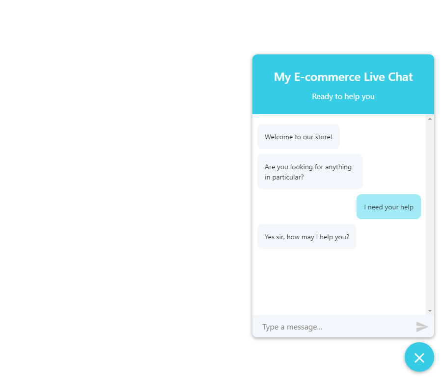
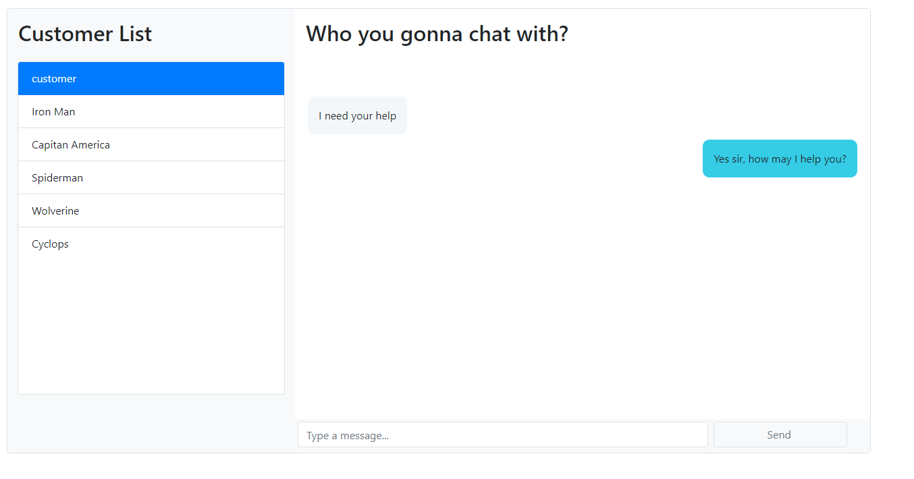

# Customer Support Widget with React

Screenshots:

## Running the demo

To run the demo first setup CometChat:

1. Head to CometChat and create an account
2. Go to the **Users** tab and click **Create User**
3. Create a user with the name "Agent" and the UID "Agent"
4. Download the repository 

Setup the server:

1. In the root directory run `npm install`
2. Run the server by running `node server.js`

Setup the client:

1. Go to the `client` directory
2. Run `npm install` there too
3. Update client/src/config.js with your credentials.
4. In another terminal run `npm start` to start the client
 
